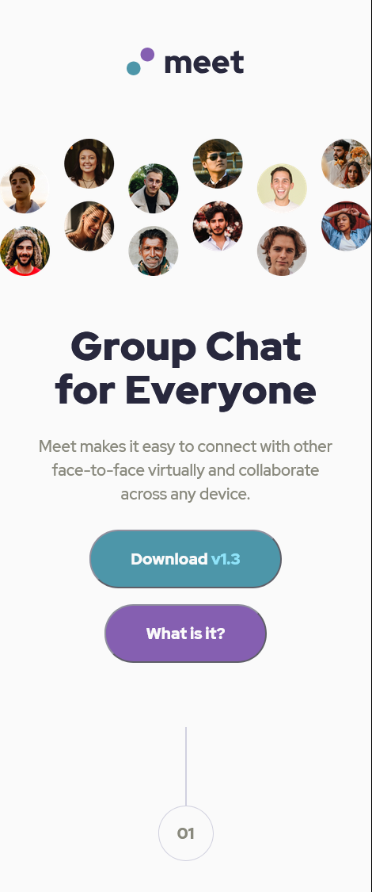
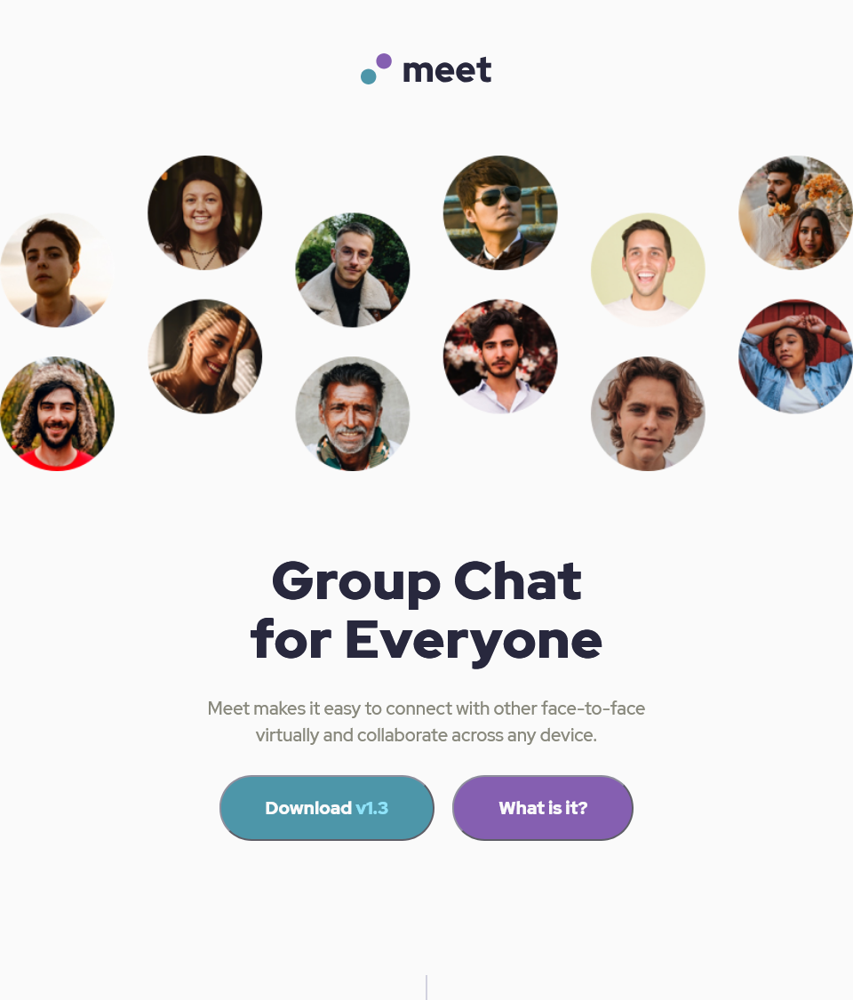
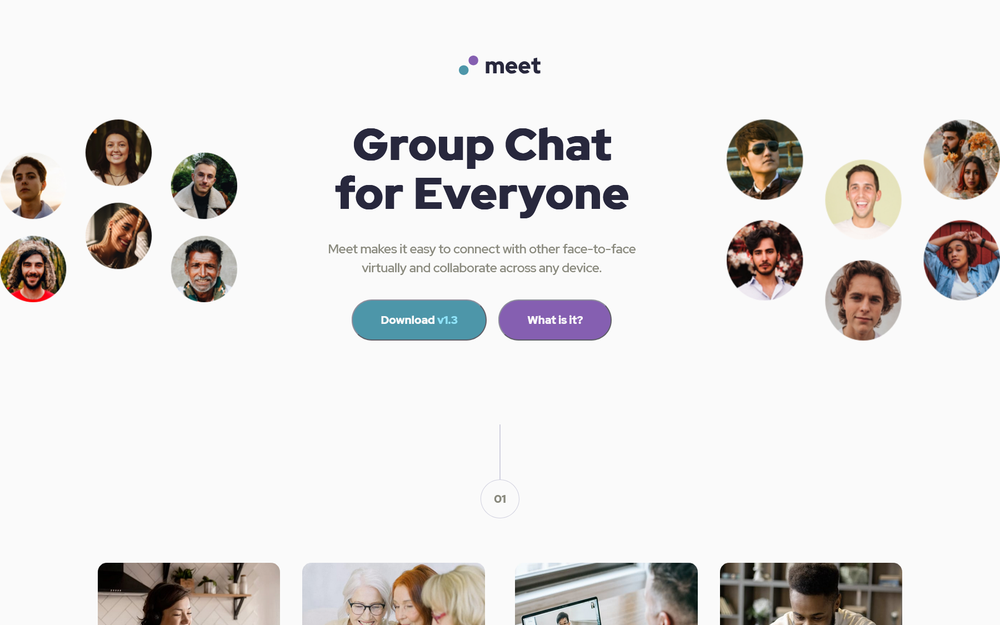

# Meet Landing Page

A responsive landing page for a fictional group chat application.

## Overview

The project was developed as a high-fidelity implementation of a Figma design, focusing on creating a seamless user experience across mobile, tablet, and desktop devices.

Key focus areas included maintaining design system, managing complex responsive layouts using a mobile-first approach, and ensuring high-quality asset delivery through optimized images.

## Live Demo

## Visual Design

| Mobile | Tablet | Desktop |
| :--- | :--- | :--- |
|  |  |  |

## The Challenge

The challenge was to build out this landing page and get it looking as close to the design as possible.

### Users should be able to:

- View the optimal layout depending on their device's screen size.
- See hover states for interactive elements.

## Built With

* HTML5
* CSS3
* Git
* GitHub
* Netlify
* Figma

## Features

* **Responsive Multi-Device Layout:** A seamless transition between mobile, tablet, and desktop views, specifically optimized for `375px`, `768px`, and `1440px` breakpoints.

* **Three-Column Desktop Transformation:** A sophisticated layout shift at `1440px` that rearranges the hero section into a balanced three-part horizontal structure.

* **Interactive UI Elements:** Custom hover states on primary buttons that provide visual feedback through color transitions and pointer changes.

* **Optimized Image Delivery:** Strategic use of the `<picture>` tag and CSS background properties to serve the correct image assets based on the user's screen resolution.

* **Accessible Markup:** Built using semantic HTML5 elements (like `<section>`, `<main>`, and `<footer>`) to ensure compatibility with screen readers and better SEO.

* **Modern CSS Architecture:** Utilization of CSS Custom Properties for theme management and a mobile-first approach for better performance and scalability, along with `normalize.css` and a custom CSS reset for cross-browser consistency.

## Author

**Christian Diaz**

- LinkedIn - [Christian Diaz](https://www.linkedin.com/in/chris-diazasc/)
- Frontend Mentor - [@chrisdzasc](https://www.frontendmentor.io/profile/chrisdzasc)